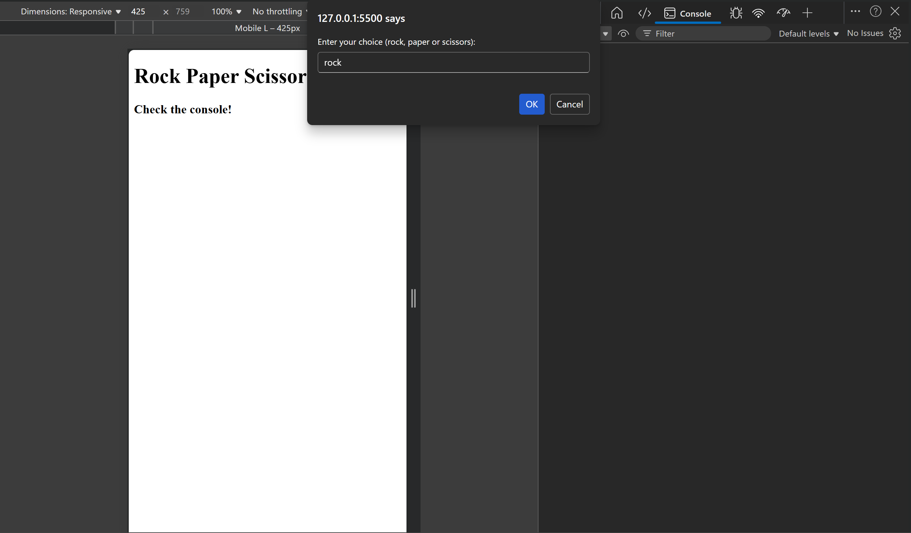
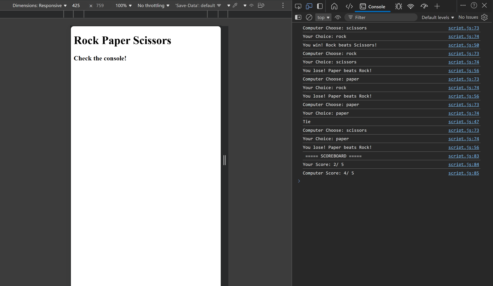

# Rock-Paper-Scissors
This is a simple implementation of the classic **Rock Paper Scissors** game, built as part of my journey into JavaScript and web development. The game is played entirely within the browser's developer console.

## 🚀 Features
- **5-Round Match:** The game runs for a total of 5 rounds.
- **Randomized AI:** The computer picks its move using a randomized logic.
- **Case-Insensitive Input:** The game accepts "Rock", "rock", or "ROCK".
- **Live Scoreboard:** Tracks your score vs. the computer and announces it at the end.

## 🛠️ Technologies Used
- **HTML5:** Basic structure for the web page.
- **JavaScript:** Game logic, including functions, loops, and conditional statements.

## 💻 Environment
- **Operating System:** Windows 11 with WSL2 (Ubuntu 22.04)
- **Development Tool:** Visual Studio Code
- **Browser (Runtime):** Microsoft Edge (Chromium)
- **Version Control:** Git

## 🎮 How to Play
1. **Open the Project:** Open the `index.html` file in any modern web browser (Edge, Chrome, Firefox).
2. **Open the Console:** - Right-click anywhere on the page and select **Inspect**.
   - Click on the **Console** tab at the top of the window that appears.
   - Alternatively, press `F12` or `Ctrl + Shift + I`.
3. **Follow the Prompts:** A popup will appear asking for your move. Type `rock`, `paper`, or `scissors`.
4. **Watch the Results:** After 5 rounds, check the console to see the final scoreboard!

| 1. User Input Prompt | 2. Console Scoreboard |
| :---: | :---: |
|  |  |

## 🧠 What I Learned
During this project, I practiced:
- Linking external JavaScript files to HTML.
- Using `Math.random()` and `Math.floor()` for computer logic.
- Handling user input via `prompt()`.
- Managing global and local variable scopes.
- Using `for` loops to repeat game rounds.

## 📝 License
This project is open-source and available under the [MIT License](LICENSE).

---
*Developed by fatema-dev*
